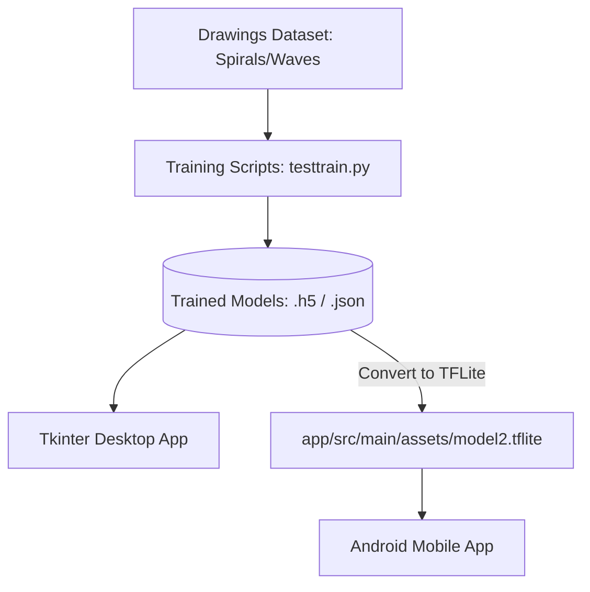

# Parkinson's Disease Detection Using Hand-Drawn Images 🧠🖊️

An end-to-end intelligent diagnostic system that detects **Parkinson's Disease** from hand-drawn drawings (like spirals and waves) using Deep Learning. The system comprises a model-training pipeline, a Tkinter desktop application for comparison/diagnostics, and an Android mobile application for real-time mobile inference.

---

## 📌 Project Overview

Parkinson's Disease (PD) is a progressive neurological disorder that heavily affects motor functions. Handwriting and drawing impairments (such as hand tremors and bradykinesia) are key early indicators. 

This project implements:
1. **Deep Learning Training Suite:** Scripts to train, validate, and compare **VGG16**, **ResNet50**, and custom **DeepCNN** architectures on drawing datasets.
2. **Interactive Desktop GUI (Tkinter):** A dashboard where users can read educational info, load trained weights, upload drawing images, test individual predictions, and view/compare metrics (Accuracy, Loss, Precision, Recall).
3. **Android Mobile App:** A mobile application that leverages **TensorFlow Lite (TFLite)** to run local, fast inference on drawings directly from a smartphone.

---

## 🛠️ System Architecture



---

## 📊 Deep Learning Models

Three models are trained and compared in this project:

| Model | Type | Input Size | Training Epochs | Target Accuracy | Key Characteristics |
| :--- | :--- | :--- | :--- | :--- | :--- |
| **DeepCNN** | Custom Sequential CNN | $64 \times 64$ | 20 Epochs | ~98.6% | Standard 2D Conv & MaxPool layers; lightweight and fast to train. |
| **ResNet50** | Transfer Learning | $224 \times 224$ | 100 Epochs | ~77.8% | Pre-trained ResNet50 base with custom dense output layers. |
| **VGG16** | Transfer Learning | $224 \times 224$ | 10 Epochs | ~99.3% | Feature extraction using VGG16 base with custom Dense layer + Dropout. Highly accurate. |

---

## 📂 Repository Directory Structure

```directory
Parkinson's_Project/
│
├── README.md                      # Project documentation (this file)
├── .gitignore                     # Git rules to ignore build files/credentials
├── readme.pdf                     # Project documentation/guide PDF
├── Execution Video.mp4            # Demo/Walkthrough video of the system
│
└── Project Codes/                 # Contains source codes
    ├── ParkinsonPrediction.py     # Main Tkinter Desktop Application
    ├── testtrain.py               # DeepCNN training script
    ├── testtrain1.py              # ResNet50 training script
    ├── testtrain2.py              # VGG16 training script
    │
    └── Parkinson's Disease Detection/  # Android Project Directory
        ├── build.gradle.kts       # Project-level Gradle config
        ├── settings.gradle.kts    # Gradle settings
        └── app/
            ├── build.gradle.kts   # App-level module configuration
            └── src/main/
                ├── AndroidManifest.xml
                ├── assets/
                │   └── model2.tflite  # Embedded TensorFlow Lite model
                ├── java/com/example/parkinsonsdiseasedetection/
                │   ├── MainActivity.kt          # Landing Screen
                │   ├── DetectParkinsonActivity.kt # Draw/Upload & TFLite Inference
                │   ├── KnowParkinsonActivity.kt   # Educational Details Screen
                │   └── ExploreActivity.kt         # Health explorer UI
                └── res/
                    ├── layout/    # UI Views (activity_main.xml, etc.)
                    └── drawable/  # Graphics & Image assets
```

---

## 💻 1. Desktop GUI Application (Tkinter)

The desktop application provides a user-friendly layout to explore the project.

### Features
* **Learn About Parkinson’s:** Educational screen highlighting Symptoms, Causes, Diagnosis, Treatments, and AI's role.
* **Test for Parkinson’s:** Load any of the three models, select a test image (e.g. a drawing), run the classifier, and view the visual diagnosis (Healthy vs. Parkinson).
* **Performance Graphs:** View training history (Accuracy vs. Loss) for the selected model.
* **Compare Models:** Automatically plot performance comparison graphs (Precision, Recall, Accuracy, Loss) side-by-side.

### Setup and Execution
1. Install dependencies:
   ```bash
   pip install opencv-python numpy tensorflow pandas matplotlib pillow
   ```
2. Run the application:
   ```bash
   python "Project Codes/ParkinsonPrediction.py"
   ```

---

## 📱 2. Android Mobile Application

An Android app allowing portable, real-time diagnostic testing.

### Features
* **Mobile Inference:** Integrates TensorFlow Lite (`model2.tflite`) for instant local image classification.
* **Simple UI:** Landing dashboard with direct access to Diagnosis, Precaution Tips, and Parkinson's Information.
* **Camera / Gallery Integration:** Upload drawing photos to get instant results.

### Setup and Build
1. Open the folder `Project Codes/Parkinson's Disease Detection` in **Android Studio**.
2. Wait for Gradle sync to complete.
3. Connect an Android device (via USB Debugging) or start an Emulator.
4. Click **Run** (`Shift + F10`) to build the project and install the APK.

---

## 🧠 3. Model Training Pipeline

If you want to train models from scratch:

1. Prepare your training dataset in the following hierarchy:
   ```directory
   dataset/
   ├── train/
   │   ├── healthy/
   │   └── parkinson/
   └── test/
       ├── healthy/
       └── parkinson/
   ```
2. Run the desired script:
   - For **DeepCNN**: `python "Project Codes/testtrain.py"`
   - For **ResNet50**: `python "Project Codes/testtrain1.py"`
   - For **VGG16**: `python "Project Codes/testtrain2.py"`
3. The trained models (`.json` for architecture and `.h5` for weights) and logs (`.pckl`) will be saved in folders `model`, `model1`, and `model2` respectively.

---

## 📜 License
This project is open-source and available under the MIT License.
